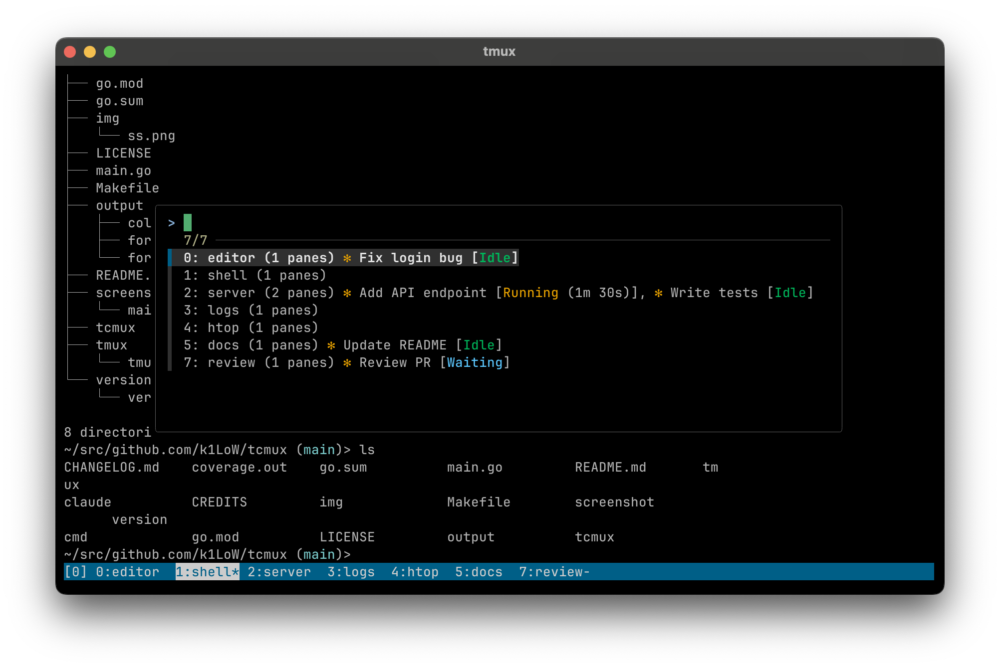

# tcmux

`tcmux` is a **t**erminal and **C**laude Code **mux** viewer.

## Usage

```console
$ tcmux list-windows  # List Claude Code instances in tmux windows (alias: lsw)
0: editor (1 panes) ✻ Fix login bug [Idle]
2: server (2 panes) ✻ Add API endpoint [Running (1m 30s)], ✻ Write tests [Idle]
5: docs (1 panes) ✻ Update README [Idle]
7: review (1 panes) ✻ Review PR [Waiting]

$ tcmux list-windows -A  # Show all windows, not just Claude Code
0: editor (1 panes) ✻ Fix login bug [Idle]
1: shell (1 panes)
2: server (2 panes) ✻ Add API endpoint [Running (1m 30s)], ✻ Write tests [Idle]
3: logs (1 panes)
4: htop (1 panes)
5: docs (1 panes) ✻ Update README [Idle]
7: review (1 panes) ✻ Review PR [Waiting]

$ tcmux list-sessions  # List tmux sessions with Claude Code status (alias: ls)
dev: 7 windows (attached) - 3 Idle, 1 Running, 1 Waiting
main: 2 windows - 1 Idle
work: 1 window
```

### Options

**list-windows:**

| Option | Description |
|--------|-------------|
| `-A, --all-windows` | Show all windows, not just Claude Code. Use this when replacing `tmux list-windows` with tcmux |
| `-a, --all-sessions` | List windows from all sessions |
| `-t, --target-session` | Specify target session |
| `-F, --format` | Specify output format (tmux-compatible with tcmux extensions) |

**Global:**

| Option | Description |
|--------|-------------|
| `--color` | When to use colors: `always`, `never`, or `auto` (default: `auto`) |

### Format Variables

tcmux supports all tmux format variables (e.g., `#{window_index}`, `#{window_name}`) plus:

| Variable | Description |
|----------|-------------|
| `#{agent_status}` | Claude Code status (context-dependent) |

- **list-windows:** `✻ Fix login bug [Idle], ✻ Add feature [Running (1m 30s, plan mode)]`
- **list-sessions:** `2 Idle, 1 Running`

**Example:**

```console
$ tcmux list-windows -F "#{window_index}:#{window_name} #{agent_status}"
$ tcmux list-sessions -F "#{session_name}: #{agent_status}"
```

### Recipe: Window switcher with Claude Code status



Replace `tmux list-windows` with `tcmux list-windows -A` in your `.tmux.conf`:

```tmux
# before
bind-key w run-shell "tmux list-windows | fzf --tmux | cut -d: -f1 | xargs tmux select-window -t"
```

```tmux
# after
bind-key w run-shell "tcmux list-windows -A --color=always | fzf --ansi --tmux | cut -d: -f1 | xargs tmux select-window -t"
```

```tmux
# screenshot example
bind -r w run-shell "tcmux lsw -A --color=always | fzf --ansi --layout reverse --tmux 80%,50% --color='pointer:24' | cut -d: -f 1 | xargs tmux select-window -t"
```

## Install

```console
$ go install github.com/k1LoW/tcmux@latest
```
